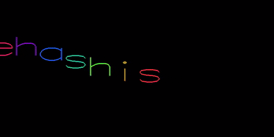

# Hi, I'm Snehashis 👋

## স্বাগতম | Welcome | नमस्ते | Hola | Guten Tag  

---

## 💡 About Me

I am a **Senior Research Engineer** working at **Videonetics Technology Private Limited**, focusing on **multimodal AI systems** that combine **vision + language + edge deployment**.

My work lies at the intersection of:

- Vision-Language Models (VLMs)
- Large Language Models (LLMs) & Small Language Models (SLMs)
- 3D Computer Vision & Computational Imaging
- Mobile / Edge AI Inference
- Real-time Intelligent Systems

---

## 🔭 Current Work

- 🚀 Building **end-to-end multimodal AI systems** (Vision + Language)
- ⚙️ Developing pipelines using **LangChain** and **LangGraph**
- 📱 Optimizing models for **on-device/mobile hardware inference**
- 🧠 Working on **efficient and scalable AI systems** for real-world deployment

---

## 🧪 Research Interests

- 3D Computer Vision & Multi-View Geometry  
- Neural Rendering (NeRF, 3D Reconstruction)  
- Computational Imaging  
- Vision-Language Alignment  
- Edge AI & Efficient Deep Learning  

---

## 💼 Experience

### 🏢 Senior Research Engineer  
**Videonetics Technology Private Limited**  
📅 Dec 2025 – Present  

- Working on **Vision-Language Models (VLMs), LLMs, and edge AI systems**
- Building **multimodal intelligent pipelines** for real-time applications  
- Optimizing **AI inference on mobile and edge hardware**

---

### 🧪 Project Associate (Computational Imaging Lab)  
**IIT Madras**  
👨‍🏫 Advisor: Prof. Kaushik Mitra  
📅 Feb 2025 – Nov 2025  

- Worked on **3D Computer Vision and Computational Imaging**
- Focused on **multi-view geometry and 3D reconstruction**
- Explored **advanced vision pipelines for real-world imaging systems**

---

### 🏢 Research Engineer  
**Videonetics Technology Private Limited**  
📅 Apr 2021 – Jan 2025  

- Developed **real-time video analytics systems**
- Built **edge-optimized deep learning models**
- Worked on **large-scale video datasets and smart city applications**
- Designed **efficient and scalable AI pipelines**

---

## 🛠 Tech Stack

**Languages & Frameworks**  
- Python, C++, PyTorch, OpenCV  

**AI / ML**  
- Deep Learning, Computer Vision, Multimodal AI  
- VLMs, LLMs, SLMs  

**Tools & Systems**  
- LangChain, LangGraph  
- TensorRT, TFLite, ONNX  
- Edge / Mobile AI Deployment  

---

## 📌 Projects & Work

👉 Check out my repositories for:  
- Multimodal AI systems  
- 3D vision and geometry  
- Edge AI inference pipelines  
- Real-time video analytics  

---

## 🌱 Currently Learning

- Advanced **3D Vision & Neural Rendering**
- Efficient **multimodal models**
- Scaling **LLM + Vision systems on edge devices**

---

## 💬 Ask Me About

- Computer Vision  
- 3D Geometry  
- Multimodal AI  
- Edge AI Deployment  
- Deep Learning Systems  

---

## 🔗 Connect with Me

- 👔 LinkedIn: https://www.linkedin.com/in/snehashis-chatterjee-576368123/  
- 🏡 Kaggle: https://www.kaggle.com/snehashis1997  
- 😊 HackerRank: https://www.hackerrank.com/Snehashis1997  
- 📄 Resume: https://drive.google.com/file/d/1mdi7HJxIwzcgROAXUZvgmIyO2rjPkSWj/view?usp=sharing  

---

## 📊 GitHub Stats

---

## ✨ Favourite Quote

> "চিত্ত যেথা ভয়শূন্য, উচ্চ যেথা শির"  
> — Rabindranath Tagore  
>
> *"Where the mind is without fear and the head is held high"*

---

⭐ *Always exploring the intersection of Vision, Language, and Intelligence*
