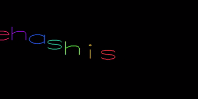

### Hi, I'm Snehashis 🙂 👋

## স্বাগতম | Welcome | नमस्ते | Hola | Guten Tag  

## My Favourite Quote

#### "চিত্ত যেথা ভয়শূন্য, উচ্চ যেথা শির" -- রবীন্দ্রনাথ ঠাকুর  
### "Where the mind is without fear and the head is held high" -- Rabindranath Tagore  

## Currently Working on 3D Computer Vision, Computational Imaging, and Computer Graphics

- 🔭 I’m currently a **Project Associate** at **IIT Madras** under **Prof. Kaushik Mitra** in the **Computational Imaging Lab**
- 🌱 I’m currently learning **3D Computer Vision, Computational Photography, NeRF, PyTorch3D, and Virtual Reality**
- 💬 Ask me about **Computer Vision, Computational Imaging, 3D Geometry, and Deep Learning**
- 🛠 I have experience in **Deep Learning, Low-Level Vision, Multi-View Geometry, and AR/VR**
- 👉 Check out my recent research projects and implementations 

## Previous Experience

- I worked at **Videonetics Technology Private Limited** as a **Research Engineer** for **four years (April 2021 - January 2025)**. My work focused on **real-time video analytics**, where I developed **computer vision, edge-computing, and digital image processing solutions**. I also worked extensively with **large-scale video analytics datasets**, designing **highly efficient and reconfigurable systems for smart city infrastructure and traffic management applications**.

## Connect with Me

👔 [LinkedIn][linkedin] **|**  
🏡 [Kaggle][kaggle] **|**  
😊 [HackerRank][HackerRank] **|**  
📄 [Resume][resume]  

## My Stats

[Videonetics Technology Private Limited]: https://www.videonetics.com/  
[resume]: https://drive.google.com/file/d/1mdi7HJxIwzcgROAXUZvgmIyO2rjPkSWj/view?usp=sharing  
[linkedin]: https://www.linkedin.com/in/snehashis-chatterjee-576368123/  
[kaggle]: https://www.kaggle.com/snehashis1997  
[HackerRank]: https://www.hackerrank.com/Snehashis1997  
